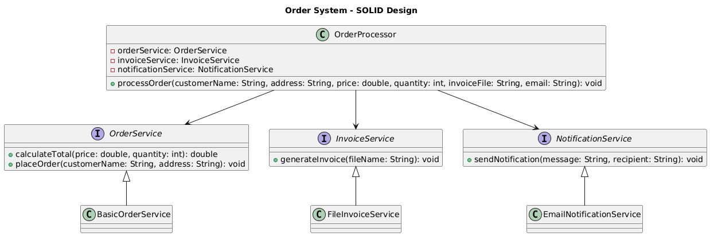

# 🧾 Order System - SOLID Principles Refactoring

## 📊 UML Class Diagram

---

## 📌 Problem Description

The original Order system design violates several SOLID principles in Object-Oriented Programming (OOP).

### Issues Identified:

1. **Single Responsibility Principle (SRP) Violation**
   - The `OrderAction` class performs multiple responsibilities:
     - Calculating total cost
     - Placing orders
     - Generating invoices
     - Sending email notifications

2. **Interface Segregation Principle (ISP) Violation**
   - The `Order` interface forces all implementing classes to include methods that may not always be needed.

3. **Open/Closed Principle (OCP) Violation**
   - The system is not easily extendable. Adding new features (e.g., SMS notifications) requires modifying existing code.

4. **Dependency Inversion Principle (DIP) Violation**
   - High-level modules depend directly on concrete implementations instead of abstractions.

---

## ✅ Solution

The system was refactored by applying SOLID principles:

- `OrderService` → Handles order-related logic
- `InvoiceService` → Handles invoice generation
- `NotificationService` → Handles notifications
- `OrderProcessor` → Coordinates all services

Each class now has a single responsibility, making the system modular, scalable, and maintainable.

---

## 🧱 Project Structure
